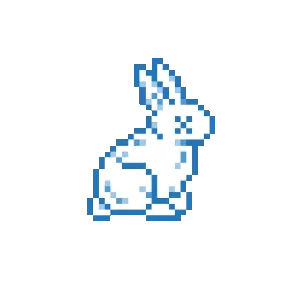

### Hi there 👋

<samp>
<small>

:pager: cyber

<a href="https://github.com/0xffsec/handbook">Pentesting Handbook</a>
 
<a href="https://github.com/0xffsec/webdojo">Web Dōjō - WebApps Pentesting Lab</a>

:shipit: devops

<a href="https://github.com/maxrodrigo/ab-testing-lambdas">λ AWS Lambdas@Edge A/B Testing</a>
 
<a href="https://github.com/maxrodrigo/cookiecutter-chalice">Cookiecutter Chalice Framework</a>

:rice_ball: rice

<a href="https://github.com/maxrodrigo/tmux-nordvpn">NordVPN Tmux Plugin</a>
 
<a href="https://github.com/maxrodrigo/homesick">homesick</a> - <small>My daily dotfiles.</small>
 
<a href="https://github.com/maxrodrigo/uz">µz</a> - <small>ZSH Micro Plugin Manager.</small>
 
<a href="https://github.com/maxrodrigo/gitster">gitster</a> - <small>A Gister ZSH theme with no dependencies.</small>

:alien: others

<a href="https://github.com/maxrodrigo/wasabi">Wasabi</a> - <small>A simple yet useful keypad</small>

 

<a href="https://www.maxrodrigo.com">Let's start working together?</a>

</small>
</samp>
